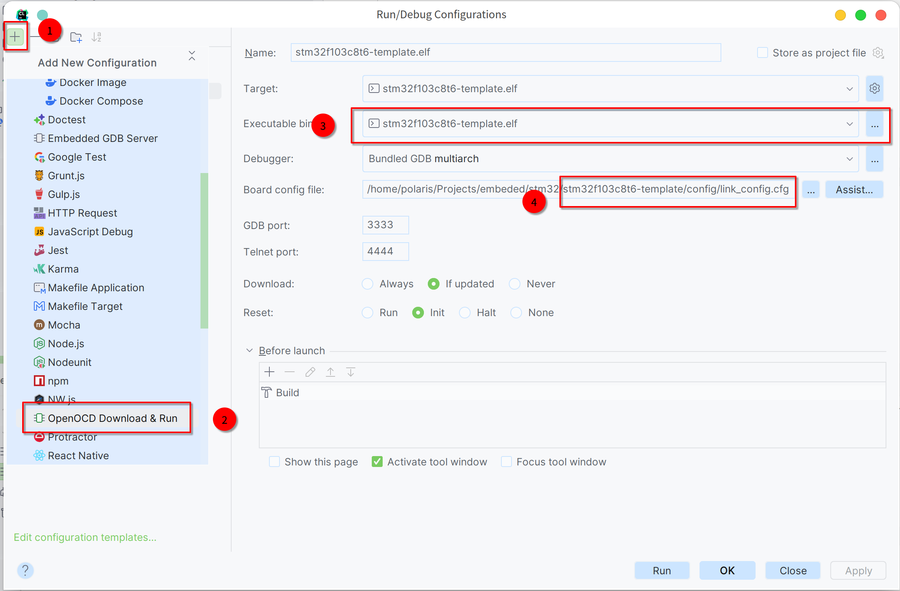

# STM32C8T6项目模板 / STM32C8T6 Project Template
```
1. 适用于STM32C8T6 / for STM32C8T6 only
2. 使用标准库开发 / use Standard Library(not HAL)
3. 适用于CLion / use CLion & cmake(neither Keli nor STM32CubeMX)
```
## CLion / Jetbrains CLion
1. 直接下载 **[CLion](https://www.jetbrains.com/clion/)** / install **[CLion](https://www.jetbrains.com/clion/)** directly
2. 使用 **[Jetbrains Toolbox](https://www.jetbrains.com/toolbox-app/)** 安装 / use **[Jetbrains Toolbox](https://www.jetbrains.com/toolbox-app/)**

## STM32CubeMX
[STM32CubeMX](https://www.st.com/zh/development-tools/stm32cubemx.html)

## openocd
```shell
sudo apt-get install openocd
# 或者 / or
sudo pacman -S openocd
```

## gcc-arm-none-eabi
```shell
sudo apt-get install gcc-arm-none-eabi
# 或者 / or
yay -S gcc-arm-none-eabi-bin
```

## st-link
[st-link](https://github.com/stlink-org/stlink)

## CLion 配置 / CLion configuration


## 项目配置 / Project configuration
`将本项目clone到本地 / git clone this project first`




